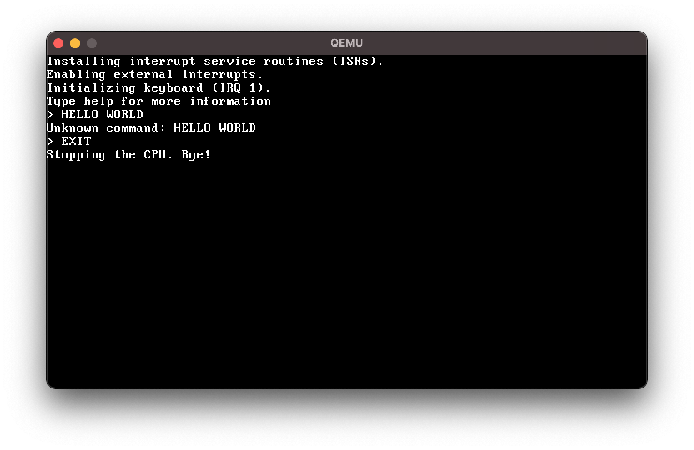

# KripayaOS
Kripaya Operating System

## What can it do?
  - Own Bootloader
  - Global Descriptor Table
  - Interrupts
  - Keyboard
  - Mini Shell

## Building
```Shell
Building: make KripayaOS.bin
Running: make all
Cleaning: make clean
```
